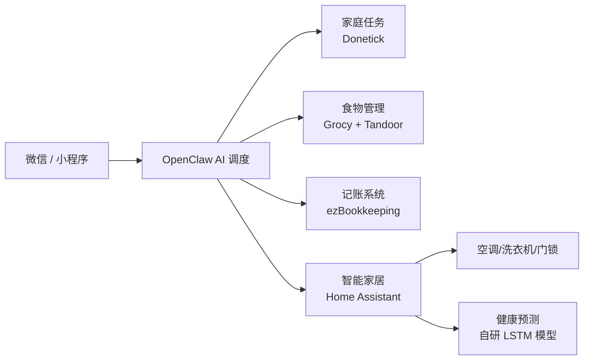

# ForMyLazyWife
🏠 一个跑在 NAS 上的家庭AI管家：微信一句话指挥家务、管理冰箱库存、自动记账，还偷偷记住了她的生理期。全本地部署，数据主权归家。

# 🏠 ForMyLazyWife / 家务OS

> *"老婆能躺着绝不坐着，能动嘴绝不动手。于是我用一台 NAS，给她搭了个隐形的家庭管家。"*

## 📖 项目起源

老婆有一天刷手机，说想要一个能听懂人话的管家，对着微信说句话就能安排家务、管冰箱、记账单。  
我整理完她的需求后，发现这不止是做个机器人，而是要把整个家“数字化”一遍。  
于是，这个项目诞生了——**代码是冷的，但日子是热的。**

## 🎯 它能做什么？

- 💬 **微信一句话指挥**：通过 OpenClaw 机器人，在微信里用自然语言安排任务、查询库存、记账。
- 📱 **小程序可视化**：家人用微信小程序查看冰箱存货、家庭账本、任务进度。
- 🗓️ **家庭任务系统**：基于 Donetick，自动编排家务，完成情况实时通知。
- 🥦 **食物状态管理**：基于 Grocy，记录食材采购/过期时间，临期自动提醒，还能根据库存推荐菜谱。
- 💰 **家用记账**：基于 ezBookkeeping，支持手动/微信触发记账，分类统计一目了然。
- 🌡️ **智能家居中枢**：Home Assistant 统一接入格力空调、美的洗衣机等设备。
- ❤️ **健康关怀（隐藏功能）**：接入 Apple Watch 数据，AI 预测生理期，提前提醒煮五红汤、苹果黄芪水。

## 🧱 技术架构

## 🗓️ 需求列表

<table>
  <thead>
    <tr>
      <th style="width: 10%">需求层级</th>
      <th style="width: 14%">模块/子系统</th>
      <th style="width: 18%">功能描述</th>
      <th style="width: 6%">状态</th>
      <th style="width: 5%">优先级</th>
      <th style="width: 22%">推荐工具/方案</th>
      <th style="width: 12%">部署位置</th>
      <th style="width: 13%">关键配置/备注</th>
    </tr>
  </thead>
  <tbody>
    <tr><td>统一交互入口</td><td>微信机器人对话入口</td><td>自然语言指令下达与结果反馈</td><td>未开发</td><td>高</td><td>OpenClaw + 微信ClawBot插件 / 企业微信</td><td>NAS Docker</td><td>日常对话用 ClawBot；系统通知用企业微信主动推送</td></tr>
    <tr><td>统一交互入口</td><td>微信小程序前端</td><td>图形化查看数据、图表、手动录入</td><td>未开发</td><td>高</td><td>uni-app 开发 + API 网关</td><td>NAS + 微信小程序后台</td><td>通过 Traefik 网关统一对外暴露，强制 HTTPS</td></tr>
    <tr><td>AI调度中枢层</td><td>意图识别与任务分发</td><td>解析自然语言并路由到对应子系统</td><td>未开发</td><td>高</td><td>OpenClaw Gateway + 大模型（由 New-API 统一管理）</td><td>NAS Docker</td><td>OpenClaw 技能指向 New-API 地址，由 New-API 负载均衡和成本控制</td></tr>
    <tr><td>AI调度中枢层</td><td>AI 模型接口管理</td><td>统一管理多个大模型 API，提供标准化接口、额度控制和负载均衡</td><td>未开发</td><td>高</td><td>New-API</td><td>NAS Docker</td><td>对接 DeepSeek、通义千问等；支持多用户隔离和 Token 预算</td></tr>
    <tr><td>AI调度中枢层</td><td>统一通知推送</td><td>将各子系统事件推送到微信</td><td>未开发</td><td>高</td><td>ntfy + OpenClaw → 企业微信主动通知</td><td>NAS Docker</td><td>日常提醒由 ClawBot 被动回复；系统级通知走企业微信</td></tr>
    <tr><td>API 网关与统一入口</td><td>反向代理与 SSL 终结</td><td>统一对外入口，自动签发和续期 SSL 证书，路由请求到内部服务</td><td>未开发</td><td>高</td><td>Traefik</td><td>NAS Docker</td><td>监听 80/443 端口，通过 Docker Labels 自动发现服务；替代 NPM</td></tr>
    <tr><td>API 网关与统一入口</td><td>网关可视化管理</td><td>提供 Web UI 管理 Traefik 路由、证书和中间件</td><td>未开发</td><td>中</td><td>Traefik Manager</td><td>NAS Docker</td><td>内网访问，简化后期运维</td></tr>
    <tr><td>家庭任务系统</td><td>任务编排与状态跟踪</td><td>一句话创建任务、查看进度、评论互动</td><td>未开发</td><td>高</td><td>Donetick</td><td>NAS Docker</td><td>通过 Traefik 路由，内网服务不暴露公网端口</td></tr>
    <tr><td>家庭任务系统</td><td>菜谱录入与点餐</td><td>菜谱管理、膳食计划、根据食材推荐</td><td>未开发</td><td>高</td><td>Tandoor Recipes</td><td>NAS Docker</td><td>与 Grocy 库存联动；内网服务</td></tr>
    <tr><td>食物状态系统</td><td>库存管理</td><td>品类、数量、采购日期、保质期管理</td><td>未开发</td><td>高</td><td>Grocy</td><td>NAS Docker</td><td>支持条码扫描；自定义临期提醒；内网服务</td></tr>
    <tr><td>食物状态系统</td><td>烹饪建议</td><td>根据现有食材推荐可制作菜肴</td><td>未开发</td><td>高</td><td>OpenClaw 调用 Grocy + Tandoor API</td><td>NAS Docker</td><td>通过 API 网关转发，内网服务</td></tr>
    <tr><td>家用记账系统</td><td>收支记录与统计</td><td>收入/支出分类记录、图表分析、实时查询</td><td>未开发</td><td>高</td><td>ezBookkeeping</td><td>NAS Docker</td><td>内网服务；支持微信/支付宝账单导入</td></tr>
    <tr><td>家用记账系统</td><td>微信触发记账</td><td>通过微信消息自动添加记账条目</td><td>未开发</td><td>高</td><td>OpenClaw + ezBookkeeping API</td><td>NAS Docker</td><td>通过 API 网关转发</td></tr>
    <tr><td>智能家居中枢</td><td>设备统一接入与控制</td><td>接入空调、洗衣机、门锁、传感器等</td><td>未开发</td><td>高</td><td>Home Assistant OS (虚拟机)</td><td>QNAP Virtualization Station</td><td>桥接网络，独立 IP；通过 Traefik 代理并信任转发</td></tr>
    <tr><td>智能家居控制</td><td>格力空调控制</td><td>开关、调温、模式切换</td><td>未开发</td><td>低</td><td>HA + Gree 集成</td><td>集成于 HA</td><td>局域网本地控制</td></tr>
    <tr><td>智能家居控制</td><td>美的洗衣机/烘干机控制</td><td>启动/暂停、模式选择</td><td>未开发</td><td>低</td><td>HA + Midea AC LAN 集成</td><td>集成于 HA</td><td>可能需降级固件</td></tr>
    <tr><td>健康监测集成</td><td>经期记录与预测</td><td>自动同步 Apple Watch 数据并 AI 预测周期</td><td>未开发</td><td>高</td><td>Health Auto Export + HA + 自建 LSTM 模型</td><td>NAS + iPhone</td><td>数据本地处理；隐私优先</td></tr>
    <tr><td>健康监测集成</td><td>经期提醒与养生茶饮任务</td><td>经期前 3 天提醒；定期推送养生茶饮提醒</td><td>未开发</td><td>高</td><td>HA 自动化 → Donetick 创建任务 → OpenClaw 推送微信</td><td>NAS Docker</td><td>任务闭环管理</td></tr>
    <tr><td>数据存储层</td><td>统一数据库</td><td>存储各子系统结构化数据及 AI 模型数据</td><td>未开发</td><td>高</td><td>PostgreSQL (主) + SQLite (子系统内置)</td><td>NAS Docker (SSD 加速)</td><td>使用 PgBouncer 连接池</td></tr>
    <tr><td>网络与安全</td><td>统一入口与 HTTPS</td><td>为所有服务提供安全的对外访问</td><td>未开发</td><td>高</td><td>Traefik 自动 Let's Encrypt</td><td>NAS Docker</td><td>仅开放 80/443；内部服务完全隐藏</td></tr>
    <tr><td>硬件平台</td><td>NAS 设备</td><td>QNAP TS-464C2: N5095/8GB RAM/4TB HDD + 128GB SSD</td><td>已完成</td><td>高</td><td>QNAP Container Station + Virtualization Station</td><td>本地</td><td>SSD 用于 Docker 热数据；HDD 用于存储</td></tr>
    <tr><td>扩展性设计</td><td>新需求接入方式</td><td>任意带 API 的服务均可无缝加入</td><td>未开发</td><td>高</td><td>在 OpenClaw 中添加技能；在 Traefik 中添加路由标签</td><td>NAS Docker</td><td>遵循“部署服务 → 配置标签 → 定义技能”标准流程</td></tr>
  </tbody>
</table>

