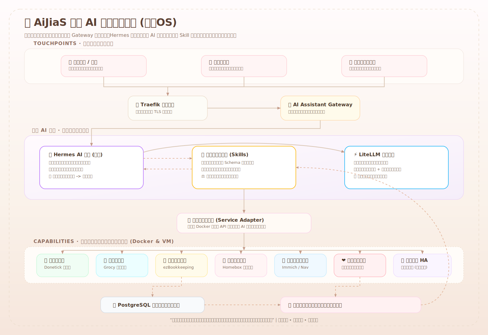

# 🏠 AiJiaS / 家务 OS

一个写给家的 AI 管家。它住在家里的 NAS 上，听得懂微信里的日常话，记得住家务、冰箱、账本、照片、健康和那些容易被生活冲散的小事。它不急着替代谁，只是安静地把家照看得更周到一点。

> *"用代码写一封给家的情书。S for Sweet，S for Her."*
> *"代码是冷的，但日子是热的。用一台 NAS，给老婆搭个隐形的家庭管家。"*

[](https://opensource.org/licenses/MIT)
[](https://www.home-assistant.io/)
[](https://www.docker.com/)
[]()

## 🗺️ 整体设计图



## 📖 项目起源

老婆有一天刷手机，说想要一个能听懂人话的管家，对着微信说句话就能安排家务、管冰箱、记账单。  
我整理完她的需求后，发现这不止是做个机器人，而是要把整个家“数字化”一遍。  
于是，这个项目诞生了。

它不是一个冷冰冰的自动化项目，而是一台小小的家庭记忆机器：记住今天谁买了菜，哪件衣服该保养，冰箱里什么快过期，哪天需要早点休息，也记住我们在日子里慢慢形成的偏好和默契。

## 🎯 它能做什么？

- 💬 **微信里说一句就好**：安排家务、查冰箱、记一笔账、设置提醒，都尽量用日常说话的方式完成。
- 🧠 **一个会慢慢懂家的管家**：Hermes 作为核心 AI 管家，记住家人的偏好、习惯和反复出现的小需求。
- 🧩 **越用越顺手的家庭技能**：当某类事情经常被重复提起，它会先整理成可复用的技能草案，等确认后再真正启用。
- 📱 **给家人的小程序窗口**：冰箱存货、家庭账本、任务进度、健康记录和提醒计划，都能有一个清楚的入口。
- 🗓️ **家务不再靠脑子硬记**：洗衣、清洁、采购、维护提醒可以进入闭环，谁做了、做到哪一步，都有迹可循。
- 🥦 **冰箱和餐桌更有默契**：记录食材和保质期，提醒临期食物，也能根据家里现有的东西推荐吃什么。
- 💰 **账本更轻一点**：一句“今天买菜 36 块”就能变成家庭账本里的记录，月底也能看懂钱花去了哪里。
- 👕 **物品也有自己的小档案**：衣物、鞋帽、床上用品、户外装备的购买、清洗、保养周期都可以被温柔地记住。
- 🎵 **照片和音乐留在家里**：照片备份、私人曲库和家庭媒体服务尽量本地保存，不把回忆随便交出去。
- 🌡️ **家里的设备听得懂生活**：空调、洗衣机、传感器等设备交给 Home Assistant 管起来，AI 只负责更自然地帮你调用。
- ❤️ **更细心的健康陪伴**：记录体温、饮食、作息、睡眠、心情、天气、季节和 Apple Watch 数据；先用规则和统计方法做提醒，等多年数据足够后，再训练真正属于个人的健康预测模型。

## 🌿 这个家的运行方式

AiJiaS 的原则很简单：外面只留一个安全入口，家里的服务都藏在内网；AI 不直接乱碰设备和账本，而是通过一层家庭守门人确认身份、记录过程、判断风险，再把事情交给对应的服务去完成。

- **对外入口**：Traefik 负责 HTTPS，外部只进入家庭 AI 助理这一扇门。
- **家庭守门人**：AI Assistant Gateway 负责企业微信校验、家庭成员识别、风险确认和调用记录。
- **AI 管家**：Hermes 负责对话、记忆、拆解任务和总结家里的长期偏好。
- **多模型调度**：LiteLLM 统一接入 GPT、Claude、Gemini、DeepSeek、Qwen 等模型，让日常任务用便宜快速的模型，规划和总结再用更强的模型。
- **技能本子**：Skill Registry 保存家里已经确认可用的技能、调用条件、确认规则和版本记录。
- **服务翻译层**：Service Adapter 把 Donetick、Grocy、Mealie/Tandoor、ezBookkeeping、Homebox、Home Assistant 等服务整理成稳定好用的家庭能力。
- **家庭记忆库**：PostgreSQL 保存业务记录、交互过程、健康时间线和技能演化历史；敏感数据默认留在家里。
- **智能家居**：Home Assistant OS 运行在 NAS 虚拟机里，负责真正连接空调、洗衣机、门锁和各种传感器。

## 🧭 为什么选择 Hermes

旧的双 Agent 试用路线已不再保留。当前方向是：**不引入 Dify，先用 Hermes 做一个更像“长期家庭管家”的核心 AI**。

这个选择更适合 AiJiaS 的原因是：家里大多数需求不是复杂办公流程，而是每天反复发生的小事。记录、提醒、协调、查询、执行、复盘，这些事情更需要长期记忆、稳定的家庭技能和足够谨慎的确认机制。Hermes 更像一个会陪家一起成长的管家，而不是一个只会跑流程的后台。

当然，这也意味着项目需要自己搭好几块基础能力：家庭入口、技能本子、调用记录、风险确认和服务连接。这样早期会多写一些代码，但换来的是更自由、更贴近这个家的系统。Dify 暂时不放进核心架构；如果以后确实需要可视化流程、复杂知识库管理或让非开发者维护流程，再重新评估。

当前推荐路线：**Hermes + LiteLLM + AI Assistant Gateway + Skill Registry + Service Adapter**。

## 🔁 会自己长出新技能

系统会在日常微信使用中记下：你原本怎么说、它理解成什么、用了哪个家庭服务、结果是否成功、你有没有纠正它。过一段时间后，它会从这些痕迹里发现重复出现的需求，整理成新的技能草案。

```text
日常微信使用
    -> 留下使用记录
    -> 发现重复需求
    -> 生成技能草案
    -> 用模拟数据检查
    -> 等待人工确认
    -> 存入家庭技能本
    -> Hermes 学会这个新技能
```

原则也很明确：可以自动发现、自动草拟、自动检查，但涉及钱、门锁、健康、隐私和批量修改的事情，必须先确认，不能偷偷扩权。

## ❤️ 健康数据与个人模型路线

女性健康模块短期不训练大模型，而是先认真记录、谨慎提醒：体温、睡眠、作息、饮食、心情、天气、季节、经期、痛感、用药、Apple Watch 指标，都会成为未来理解身体节律的线索。等这些数据积累得足够久，再训练轻量的个人预测模型，用来辅助判断周期、痛感风险、PMS 风险，以及备孕/孕期营养规划。

大模型只负责解释、总结、计划和提醒，不作为医学诊断工具。涉及剧烈疼痛、异常出血、怀孕期间腹痛/出血、发热、晕厥等情况时，系统必须越过所有“智能判断”，直接提醒及时联系医生。

## 📁 仓库目录结构
```tree
AiJiaS/
├── README.md # 项目总览（本文件）
├── LICENSE # 开源协议
├── .gitignore
│
├── docs/ # 📚 文档中心
│ ├── architecture.md # 系统架构图（Mermaid）
│ ├── requirements.md # 需求跟踪表
│ ├── hybrid-deployment.md # HAOS虚拟机 + Docker混合部署总览
│ ├── haos-npm-setup.md # HAOS 接入 Traefik 指南
│ ├── agent-trial-plan.md # AI 管家选择记录（Hermes 为主线）
│ ├── homebox-setup.md # Homebox 部署与集成指南
│ └── changelog.md # 变更日志
│
├── docker-compose/ # 🐳 服务编排
│ ├── core-services.yml # 家庭 AI、模型入口、通知和数据底座
│ ├── traefik.yml # Traefik + Traefik Manager
│ ├── family-systems.yml # Donetick, Grocy, Tandoor, ezBookkeeping, TREK, Homebox
│ ├── media.yml # Immich, Navidrome, Go Music DL, Go Novel DL
│ ├── ai-models.yml # period-predictor
│ ├── chat.yml # silly-tavern
│ └── .env.example # 环境变量模板
│
├── gateway/ # 🛡️ 家庭 AI 入口（微信、身份确认、风险提醒）
│ └── README.md
│
├── hermes/ # 🧠 家里的 AI 管家（Hermes 主线）
│ └── skills/ # Hermes 技能配置目录
│  └── README.md # 技能开发说明
│
├── skills/ # 🧩 家庭技能本（可复用技能、确认规则、版本记录）
│ └── README.md
│
├── home-assistant/ # 🏡 智能家居配置
│ ├── configuration.yaml
│ ├── automations.yaml
│ ├── sensors.yaml
│ ├── input_datetime.yaml
│ └── customize.yaml
│
├── ai-models/ # 🤖 AI 模型与个人健康预测实验
│ └── period-predictor/
│  ├── training/
│  ├── inference/
│  └── README.md
│
├── scripts/ # 🔧 运维脚本
│ ├── backup-db.sh
│ ├── health-check.sh
│ └── sync-ha-config.sh
│
├── miniprogram/ # 📱 微信小程序（预留）
│ └── README.md
│
└── assets/ # 🖼️ 静态资源
 └── architecture.png

```

## 🚀 快速开始
```bash
git clone https://github.com/你的用户名/AiJiaS.git
cd AiJiaS
...

