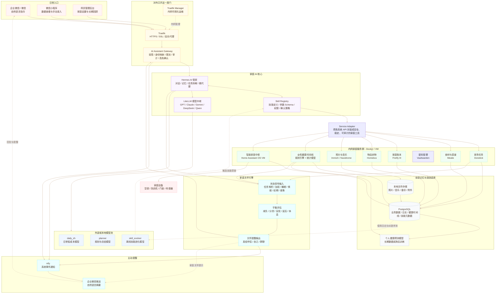
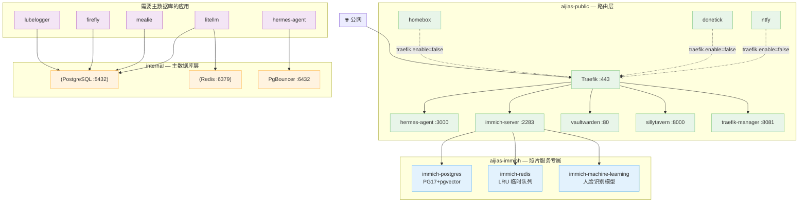

# 系统架构设计图

## AiJiaS / 家物 OS 总体架构

> 最新主线：对外只开放 AI Assistant Gateway；Hermes 负责长期记忆与任务拆解；LiteLLM 负责多模型路由；所有家庭服务只在内网通过 Skill Registry 与 Service Adapter 被安全调用。



## Docker 网络拓扑（三层隔离）

> 三层网络实现数据库隔离：`aijias-public` 对外路由、`aijias-internal` 主数据库专用、`aijias-immich` Immich 内部专用。



### 网络隔离规则

| 网络 | 创建方式 | 成员 | 可以看到什么 |
|------|---------|------|------------|
| `aijias-public` | 手动 `docker network create` | Traefik + 需要对外暴露的服务 + 无 DB 依赖的轻量服务 | 所有同网络容器的端口 |
| `aijias-internal` | `database.yml` 自动创建 | PostgreSQL、Redis、PgBouncer + 需要主 DB 的应用 | 主数据库端口 5432/6379/6432 |
| `aijias-immich` | `media.yml` 自动创建 | 仅 Immich 4 个容器（server、postgres、redis、ml） | Immich 专属数据库端口 |

> **关键原则**：`immich-postgres` 不在 `aijias-internal` 网络中，主 PostgreSQL 不在 `aijias-immich` 中，两者物理隔离。Immich 升级/崩溃不影响家庭账本和菜谱数据。

## 长期最佳架构

AiJiaS 的长期架构原则是：**成熟基础设施用现成镜像，家庭专属逻辑自建镜像，自建服务尽量小而稳定，并通过 profiles 分阶段启用**。

```text
Traefik
  -> AI Assistant Gateway       自建，唯一公网业务入口
      -> Hermes Runtime         自建封装或官方镜像
          -> LiteLLM            官方镜像，多模型路由
          -> Skill Registry     后期自建，技能版本与权限管理
          -> Service Adapter    自建，统一封装家庭系统 API
              -> Donetick
              -> Mealie
              -> Firefly III
              -> Homebox
              -> Home Assistant
              -> Immich
              -> Navidrome
              -> Period Predictor
              -> Vaultwarden         Bitwarden 兼容密码管理器
      -> ntfy / 企业微信
```

这套结构把“家里的业务判断”和“成熟开源服务”分开：Traefik 只负责入口和证书；LiteLLM 只负责模型路由；Donetick、Mealie、Firefly III、Homebox、Immich 等只做各自擅长的事情；AiJiaS 自建层只负责家庭身份、权限、审计、技能与服务适配。

自建镜像的目录组织、Dockerfile 模板、构建命令和发布检查清单见 [self-built-images.md](self-built-images.md)。

## 镜像建设策略

| 类型 | 服务 | 策略 |
| :--- | :--- | :--- |
| 成熟底座 | Traefik、PostgreSQL、Redis、PgBouncer、ntfy、LiteLLM | 直接拉取官方或成熟镜像，稳定后固定版本或 digest。 |
| 家庭子系统 | Donetick、Mealie、Firefly III、Homebox、Immich、Navidrome | 直接使用上游镜像，默认只在内网暴露。 |
| 家庭子系统 | Vaultwarden | 直接使用上游镜像，默认只在内网暴露。 |
| 必须自建 | AI Assistant Gateway、Service Adapter | 长期必须自建，因为它们包含家庭成员映射、权限、审计、高危确认和统一 API 适配。 |
| 可后期自建 | Hermes Runtime、Skill Registry、Skill Miner、Period Predictor | 用 profiles 延后启用，避免未完成镜像阻塞基础设施启动。 |

## 分阶段启动策略

默认启动只应该包含已经稳定可拉取的基础设施，以及已经完成构建的自建服务。尚未完成的模块通过 Docker Compose profiles 控制：

| Profile | 服务 | 何时启用 |
| :--- | :--- | :--- |
| `gateway` | `ai-gateway`、`service-adapter` | 完成第一版企业微信入口和内部 API 适配后启用。 |
| `agent` | `hermes-agent` | Hermes Runtime 镜像确定后启用。 |
| `skills` | `skill-registry`、`skill-miner` | 技能目录稳定、有真实调用日志后启用。 |
| `health` | `period-predictor` | 健康记录数据结构稳定后启用。 |
| `local-llm` | `ollama` | NAS 性能允许并需要本地模型时启用。 |

推荐落地顺序：

```text
1. 先启动基础设施：Traefik / PostgreSQL / Redis / PgBouncer / LiteLLM / ntfy
2. 启动家庭子系统：Donetick / Mealie / Firefly III / Homebox / Immich / Navidrome / Vaultwarden
3. 自建并启用 AI Assistant Gateway
4. 自建并启用 Service Adapter
5. 接入 Hermes Runtime
6. 再做 Skill Registry / Skill Miner / Period Predictor
## 自建镜像边界

`AI Assistant Gateway` 不只是普通反向代理，它需要理解企业微信身份、家庭成员、敏感操作确认、审计日志和回复链路；这部分不能完全交给 Traefik、Kong 或 APISIX。

`Service Adapter` 也不只是 API 转发，它负责把不同家庭系统的 API 统一成稳定工具，例如 `create_expense`、`create_task`、`query_inventory`、`call_home_assistant`。这样 Hermes 不需要直接面对每个系统的复杂 API，也不会绕过风险策略直接修改账本、门锁或健康数据。
